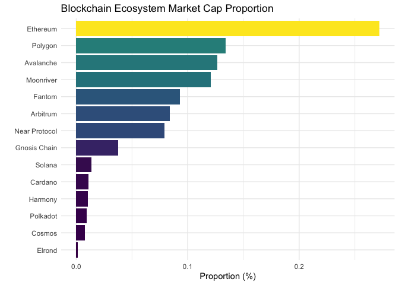
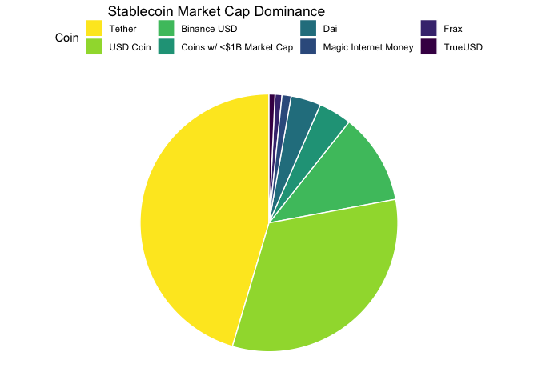

<!-- README.md is generated from README.Rmd. Please edit that file -->

# rcoingecko 

<!-- badges: start -->

[](https://lifecycle.r-lib.org/articles/stages.html#experimental)
[](https://CRAN.R-project.org/package=rcoingecko)
<!-- badges: end -->

R Package for Querying Cryptocurrency Data from the [CoinGecko
API](https://www.coingecko.com/api/documentations/v3)

------------------------------------------------------------------------

## Installation

You can install the development version of rcoingecko from
[GitHub](https://github.com/southernt/rcoingecko) with:

``` r
# install.packages("devtools")
devtools::install_github("southernt/rcoingecko")
```

## Examples

``` r
library(rcoingecko)
```

Query available cryptocurrencies and quote crypto/fiat currencies

``` r
## table
cg_supported_coins()
#> # A tibble: 5,014 × 3
#>    id       symbol name    
#>    <chr>    <chr>  <chr>   
#>  1 01coin   zoc    01coin  
#>  2 0cash    zch    0cash   
#>  3 0chain   zcn    0chain  
#>  4 0-mee    ome    O-Mee   
#>  5 0x       zrx    0x      
#>  6 0xcert   zxc    0xcert  
#>  7 0xdao    oxd    0xDAO   
#>  8 0xdao-v2 oxd v2 0xDAO V2
#>  9 0xmonero 0xmr   0xMonero
#> 10 0xpad    0xpad  0xPAD   
#> # … with 5,004 more rows

## vector
cg_supported_vs_currencies()
#>  [1] "btc"  "eth"  "ltc"  "bch"  "bnb"  "eos"  "xrp"  "xlm"  "link" "dot" 
#> [11] "yfi"  "usd"  "aed"  "ars"  "aud"  "bdt"  "bhd"  "bmd"  "brl"  "cad" 
#> [21] "chf"  "clp"  "cny"  "czk"  "dkk"  "eur"  "gbp"  "hkd"  "huf"  "idr" 
#> [31] "ils"  "inr"  "jpy"  "krw"  "kwd"  "lkr"  "mmk"  "mxn"  "myr"  "ngn" 
#> [41] "nok"  "nzd"  "php"  "pkr"  "pln"  "rub"  "sar"  "sek"  "sgd"  "thb" 
#> [51] "try"  "twd"  "uah"  "vef"  "vnd"  "zar"  "xdr"  "xag"  "xau"  "bits"
#> [61] "sats"
```

Query available exchanges.

``` r
cg_exchanges()
#> # A tibble: 100 × 12
#>    id    name  year_established country description url   image has_trading_inc…
#>    <chr> <chr>            <int> <chr>   <chr>       <chr> <chr> <lgl>           
#>  1 bina… Bina…             2017 Cayman… ""          http… http… FALSE           
#>  2 ftx_… FTX               2019 Antigu… ""          http… http… FALSE           
#>  3 gdax  Coin…             2012 United… ""          http… http… FALSE           
#>  4 kuco… KuCo…             2014 Seyche… ""          http… http… FALSE           
#>  5 huobi Huob…             2013 Seyche… ""          http… http… FALSE           
#>  6 okex  OKX               2013 Belize  ""          http… http… FALSE           
#>  7 cryp… Cryp…             2019 Cayman… "Crypto.co… http… http… FALSE           
#>  8 krak… Krak…             2011 United… ""          http… http… FALSE           
#>  9 woot… WOO …             2019 <NA>    "WOO Netwo… http… http… FALSE           
#> 10 bitf… Bitf…             2014 Britis… ""          http… http… FALSE           
#> # … with 90 more rows, and 4 more variables: trust_score <int>,
#> #   trust_score_rank <int>, trade_volume_24h_btc <dbl>,
#> #   trade_volume_24h_btc_normalized <dbl>
```

Query available crytocurrency/blockchain platforms.

``` r
cg_asset_platforms()
#> # A tibble: 107 × 4
#>    id            chain_identifier name          shortname
#>    <chr>                    <int> <chr>         <chr>    
#>  1 factom                      NA Factom        <NA>     
#>  2 openledger                  NA OpenLedger    <NA>     
#>  3 cosmos                      NA Cosmos        <NA>     
#>  4 binancecoin                 NA Binance Coin  <NA>     
#>  5 metaverse-etp               NA Metaverse ETP <NA>     
#>  6 nem                         NA NEM           <NA>     
#>  7 moonbeam                  1284 Moonbeam      <NA>     
#>  8 icon                        NA ICON          <NA>     
#>  9 waves                       NA Waves         <NA>     
#> 10 kava                        NA Kava          <NA>     
#> # … with 97 more rows
```

Query crytocurrency categories.

``` r
cg_categories()
#> # A tibble: 75 × 8
#>    id           name  market_cap market_cap_chan… content top_3_coins volume_24h
#>    <chr>        <chr>      <dbl>            <dbl> <chr>   <list>           <dbl>
#>  1 ethereum-ec… Ethe…    5.15e11            0.378  <NA>   <chr [3]>      9.23e10
#>  2 smart-contr… Smar…    3.96e11            0.336 "Smart… <chr [3]>      2.49e10
#>  3 binance-sma… BNB …    2.63e11            0.872 "BNB C… <chr [3]>      7.09e10
#>  4 polygon-eco… Poly…    2.53e11            0.920  <NA>   <chr [3]>      6.90e10
#>  5 avalanche-e… Aval…    2.39e11            0.864  <NA>   <chr [3]>      6.67e10
#>  6 moonriver-e… Moon…    2.29e11            0.675  <NA>   <chr [3]>      6.54e10
#>  7 fantom-ecos… Fant…    1.76e11            0.897 "FANTO… <chr [3]>      6.46e10
#>  8 stablecoins  Stab…    1.64e11            0.629  <NA>   <chr [3]>      6.10e10
#>  9 arbitrum-ec… Arbi…    1.59e11            0.735  <NA>   <chr [3]>      5.75e10
#> 10 near-protoc… Near…    1.50e11            0.951 "NEAR … <chr [3]>      5.60e10
#> # … with 65 more rows, and 1 more variable: updated_at <chr>
```

Plot crytocurrency/blockchain platform market proportion.

``` r
gg_crypto_platform_prop()
```



Query current crytocurrency market summary.

``` r
cg_coin_markets_summ()
#> # A tibble: 100 × 25
#>    id          symbol name        image current_price market_cap market_cap_rank
#>    <chr>       <chr>  <chr>       <chr>         <dbl>      <dbl>           <int>
#>  1 bitcoin     btc    Bitcoin     http…    29247         5.57e11               1
#>  2 ethereum    eth    Ethereum    http…     1966.        2.38e11               2
#>  3 tether      usdt   Tether      http…        1.00      7.43e10               3
#>  4 usd-coin    usdc   USD Coin    http…        1.00      5.32e10               4
#>  5 binancecoin bnb    BNB         http…      303.        5.10e10               5
#>  6 ripple      xrp    XRP         http…        0.412     1.99e10               6
#>  7 binance-usd busd   Binance USD http…        1.00      1.86e10               7
#>  8 cardano     ada    Cardano     http…        0.518     1.75e10               8
#>  9 solana      sol    Solana      http…       50.2       1.71e10               9
#> 10 dogecoin    doge   Dogecoin    http…        0.0843    1.12e10              10
#> # … with 90 more rows, and 18 more variables: fully_diluted_valuation <dbl>,
#> #   total_volume <dbl>, high_24h <dbl>, low_24h <dbl>, price_change_24h <dbl>,
#> #   price_change_percentage_24h <dbl>, market_cap_change_24h <dbl>,
#> #   market_cap_change_percentage_24h <dbl>, circulating_supply <dbl>,
#> #   total_supply <dbl>, max_supply <dbl>, ath <dbl>,
#> #   ath_change_percentage <dbl>, ath_date <dttm>, atl <dbl>,
#> #   atl_change_percentage <dbl>, atl_date <dttm>, last_updated <dttm>
```

``` r
gg_stablecoins_pie()
```



------------------------------------------------------------------------

## Existing Packages

-   [CoinGeckoR](https://github.com/SamBuckberry/CoinGeckoR)
-   [geckor](https://github.com/next-game-solutions/geckor)
